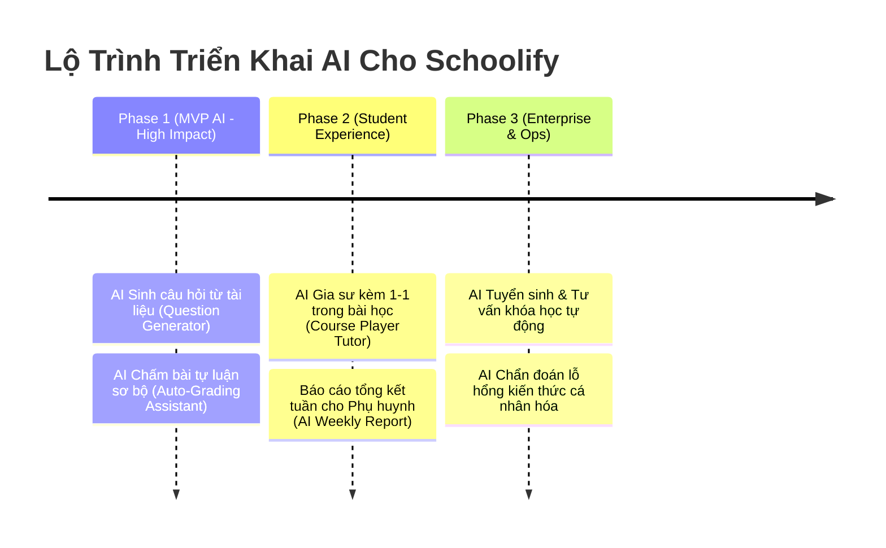

# 🚀 Ý Tưởng Tích Hợp AI Cho Hệ Thống Schoolify (AI Feature Ideas)

Tài liệu này tổng hợp toàn bộ các điểm chạm trí tuệ nhân tạo (AI Integration Touchpoints) trong hệ sinh thái EdTech Schoolify, được phân chia theo từng vai trò (Role) và kiến trúc kỹ thuật tương ứng.

---

## 1. 🧑‍🏫 Dành Cho Giáo Viên & Trưởng Bộ Môn (TEACHER & HEAD_OF_DEPARTMENT)

### 1.1. AI Chấm Bài Tự Luận & Tạo Lời Phê (AI Auto-Grading & Detailed Feedback)
- **Vị trí tích hợp:** `ExamSubmission` & `SubmissionAnswer` (Màn hình chấm bài của giáo viên).
- **Mô tả hoạt động:**
  - Giáo viên cung cấp đề bài kèm barem chấm / gợi ý đáp án chuẩn.
  - Khi học sinh nộp bài tự luận (`text_answer`), AI tự động phân tích:
    - Độ chính xác của kiến thức & lập luận logic.
    - Soát lỗi ngữ pháp, chính tả, cách dùng từ.
    - Dự thảo điểm số sơ bộ (`points_earned`).
    - Viết nhận xét chi tiết (`teacher_feedback`): Chỉ ra điểm mạnh, điểm cần sửa và gợi ý cách làm tốt hơn.
  - Giáo viên chỉ cần xem lại, duyệt (Approve) hoặc điều chỉnh nhanh.
- **Giá trị:** Giảm tới 80% thời gian chấm bài thủ công của giáo viên.

### 1.2. AI Tạo Ngân Hàng Câu Hỏi & Đề Thi Tự Động (Document to Quiz/Question Bank)
- **Vị trí tích hợp:** `QuestionBank` / `LessonMaterial`.
- **Mô tả hoạt động:**
  - Giáo viên tải lên tài liệu bài giảng (PDF, Word, Slide) hoặc nhập chủ đề.
  - AI bóc tách nội dung và sinh ra bộ câu hỏi với đầy đủ các định dạng:
    - Trắc nghiệm (`MULTIPLE_CHOICE`, `SINGLE_CHOICE`, `TRUE_FALSE`) kèm 4 đáp án và giải thích chi tiết (`explain`).
    - Tự luận (`ESSAY`) kèm barem chấm điểm mẫu.
    - Phân loại độ khó tự động theo 4 cấp độ Bloom: *Nhận biết - Thông hiểu - Vận dụng - Vận dụng cao*.

### 1.3. AI Soạn Đề Cương & Khung Bài Giảng (Course Syllabus & Outline Copilot)
- **Vị trí tích hợp:** `Course Builder` / `Lesson Builder`.
- **Mô tả hoạt động:**
  - Giáo viên nhập ý tưởng/mục tiêu đầu ra (Ví dụ: *"Khóa học Luyện thi IELTS 6.5 trong 3 tháng"*).
  - AI tự động xây dựng cây cấu trúc bài giảng (`Lesson`), mục tiêu từng chương, gợi ý tài liệu học tập và bài tập thực hành.

### 1.4. AI Phụ Đề & Tóm Tắt Video Bài Giảng (Auto-Subtitles & Video Summarizer)
- **Vị trí tích hợp:** `Lesson.video_url`.
- **Mô tả hoạt động:**
  - Bóc băng âm thanh (Speech-to-Text) tự động tạo phụ đề đa ngôn ngữ cho video.
  - Trích xuất các ý chính (Key Takeaways) và dòng thời gian (Chapters) của video bài học.

---

## 2. 🧑‍🎓 Dành Cho Học Sinh (STUDENT)

### 2.1. AI Gia Sư Kèm 1-1 Trong Phòng Học (AI Socratic Learning Tutor 24/7)
- **Vị trí tích hợp:** Trình phát bài học (`Course Learning Player`).
- **Mô tả hoạt động:**
  - Chatbot AI tích hợp trực tiếp bên cạnh video/tài liệu bài học.
  - Học sinh có thể bôi đen đoạn văn bản khó hiểu hoặc hỏi bài trực tiếp.
  - AI giải thích theo phương pháp gợi mở (Socratic Method) – đưa ra câu hỏi dẫn dắt và ví dụ đời thường thay vì chỉ ném ra đáp án cuối cùng.

### 2.2. AI Chẩn Đoán Lỗ Hổng Kiến Thức (Knowledge Gap Diagnostic)
- **Vị trí tích hợp:** `Student Dashboard` & Trang kết quả thi `ExamSubmission`.
- **Mô tả hoạt động:**
  - Phân tích lịch sử các câu làm sai của học sinh qua nhiều bài kiểm tra.
  - Đưa ra chẩn đoán: *"Học sinh đang bị hổng kiến thức ở Chương 3: Phương trình bậc hai"*.
  - Tự động gợi ý các bài học và bài tập cần xem lại để bù đắp kiến thức.

### 2.3. AI Tạo Flashcard & Mindmap Ôn Tập Tức Thì
- **Vị trí tích hợp:** Giao diện bài học `Lesson`.
- **Mô tả hoạt động:**
  - Chỉ với 1 nút bấm, AI chuyển hóa toàn bộ nội dung lý thuyết bài học thành:
    - Bộ thẻ ghi nhớ Flashcard (Mặt trước: Câu hỏi/Từ vựng, Mặt sau: Định nghĩa/Giải thích).
    - Sơ đồ tư duy tóm lược kiến thức phục vụ ôn thi nhanh.

---

## 3. 👨‍👩‍👧 Dành Cho Phụ Huynh (PARENT)

### 3.1. Báo Cáo Tổng Kết Học Tập Thông Minh Hàng Tuần (AI Weekly Academic Summary)
- **Vị trí tích hợp:** `Parent Dashboard` / `Notification`.
- **Mô tả hoạt động:**
  - Thay vì phụ huynh phải đọc bảng điểm và số liệu khô khan, AI tổng hợp toàn bộ hoạt động trong tuần của con thành 1 bản tóm tắt tự nhiên:
    > *"Tuần này cháu Minh học rất tích cực môn Toán (đạt 9/10 điểm bài kiểm tra hình học). Môn Tiếng Anh cháu còn bỏ lỡ 1 bài tập về nhà ngày thứ Năm. Đề xuất: Phụ huynh động viên cháu luyện thêm phần từ vựng Unit 4..."*

### 3.2. AI Tư Vấn Đồng Hành Cùng Con (Parenting Advisor)
- Đưa ra lời khuyên cho phụ huynh cách giao tiếp, hỗ trợ con giải tỏa áp lực thi cử dựa trên biểu đồ học tập thực tế.

---

## 4. 🏢 Dành Cho Ban Giám Hiệu & Vận Hành (PRINCIPAL & STAFF)

### 4.1. AI Chatbot Tư Vấn & Tuyển Sinh 24/7 (Admissions & Course Consultant)
- **Vị trí tích hợp:** Trang chủ Trường / Marketplace Khóa học.
- **Mô tả hoạt động:**
  - Tiếp đón phụ huynh và học sinh mới, tư vấn lộ trình học tập, lịch học, học phí phù hợp.
  - Tự động thu thập thông tin liên hệ (Lead Generation) và đẩy về danh sách cho `STAFF` chăm sóc.

### 4.2. AI Dự Báo Nguy Cơ Bỏ Học / Học Lực Giảm Sút (Dropout Risk Predictor)
- **Vị trí tích hợp:** `Principal Dashboard`.
- **Mô tả hoạt động:**
  - Quét dữ liệu chuyên cần và điểm số: Nếu học sinh không vào học quá 10 ngày hoặc điểm giảm 3 lần liên tiếp, hệ thống phát tín hiệu cảnh báo sớm để nhà trường kịp thời can thiệp.

---

## 5. 👑 Dành Cho Super Admin (SUPER_ADMIN)

### 5.1. AI Kiểm Duyệt Nội Dung Tự Động (Automated Content Moderation)
- **Vị trí tích hợp:** Khóa học xuất bản lên Marketplace.
- **Mô tả hoạt động:**
  - Tự động kiểm tra văn bản, hình ảnh, tài liệu khóa học để phát hiện nội dung độc hại, vi phạm bản quyền, spam trước khi cho phép công khai lên sàn.

---

## 🗺️ Lộ Trình Triển Khai Đề Xuất (AI Roadmap)

---

## 🛠️ Kiến Trúc Công Nghệ Đề Xuất (Technical Stack)
- **Mô hình LLM:** Google Gemini 2.5 / OpenAI GPT-4o / Claude 3.5 Sonnet.
- **RAG & Vector Search:** PostgreSQL với extension `pgvector` (Tận dụng ngay DB PostgreSQL hiện tại) để tìm kiếm ngữ nghĩa trong bài giảng.
- **Hàng đợi xử lý ngầm (Background Queue):** BullMQ + Redis để xử lý các tác vụ AI mất nhiều thời gian (bóc băng video, sinh ngân hàng đề thi).
