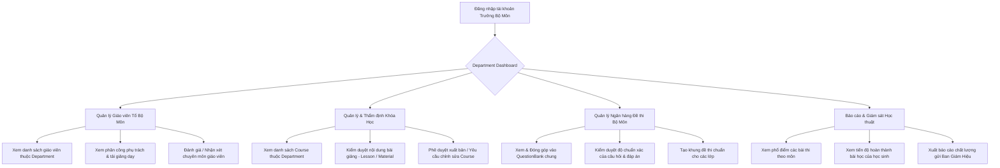

# Luồng Nghiệp Vụ: HEAD_OF_DEPARTMENT (Trưởng Bộ Môn / Tổ Trưởng Chuyên Môn)

## 1. Tổng quan Role
`HEAD_OF_DEPARTMENT` là giáo viên kiêm nhiệm vị trí quản lý chuyên môn của một Tổ/Bộ môn (ví dụ: Tổ Toán, Tổ Ngoại ngữ, Tổ Khoa học Tự nhiên) thuộc một Trường/Trung tâm (`School`).
Mục tiêu chính:
- Quản lý chất lượng đào tạo và giáo án của toàn bộ giáo viên trực thuộc bộ môn.
- Thẩm định, phê duyệt các Khóa học (`Course`) và Ngân hàng câu hỏi (`QuestionBank`).
- Theo dõi phân công giảng dạy và chất lượng điểm số của học sinh trong các lớp thuộc chuyên môn của mình.

---

## 2. Sơ đồ Luồng chính (Flowchart)

---

## 3. Chi tiết các Chức năng (Dành cho Frontend)

Frontend cần tích hợp các màn hình quản lý chuyên môn vào Navigation của Trưởng bộ môn (có thể là một Tab riêng "Quản trị Bộ môn" hoặc chuyển đổi qua Switch Role nếu vừa là Giáo viên vừa là Trưởng bộ môn).

### 3.1. 📊 Department Dashboard
- **Mục đích:** Nắm bắt nhanh hoạt động chuyên môn của cả tổ.
- **Thành phần UI cần có:**
  - Card thống kê: Tổng số giáo viên trong tổ, Số lượng khóa học đang chạy, Số đề thi đã duyệt, Tổng số học sinh đang học môn này.
  - Widget "Cần duyệt": Danh sách bài giảng / khóa học mới tạo của giáo viên đang chờ duyệt xuất bản (`status = PENDING`).
  - Biểu đồ: Phổ điểm trung bình các bài kiểm tra gần nhất của các lớp thuộc bộ môn.

### 3.2. 🧑‍🏫 Quản lý Giáo viên thuộc Bộ Môn
- **Mục đích:** Theo dõi khối lượng công việc và chất lượng giảng dạy của từng giáo viên trong tổ.
- **Thành phần UI cần có:**
  - Danh sách `TeacherProfile` có `department_id` trùng khớp.
  - Hiển thị thông tin: Họ tên, Chuyên môn (`expertise`), Số năm kinh nghiệm (`experience_years`), Số lớp đang phụ trách (`classes_managed`), Số khóa học đã tạo.
  - Xem nhanh lịch dạy của từng giáo viên để nắm tình hình quá tải hoặc thiếu người.

### 3.3. 📖 Quản lý & Kiểm duyệt Khóa học (Courses & Lessons)
- **Mục đích:** Đảm bảo chất lượng nội dung trước khi học sinh học hoặc trung tâm đem bán.
- **Thành phần UI cần có:**
  - Bộ lọc Course theo trạng thái: `DRAFT`, `PENDING`, `PUBLISHED`, `REJECTED`.
  - Màn hình xem chi tiết Course: Cây bài giảng (`Lesson`), tài liệu đính kèm (`LessonMaterial`), video.
  - Thanh công cụ duyệt: Nút **Approve** (Chuyển sang `PUBLISHED`) hoặc **Request Changes** (Kèm khung nhập lý do từ chối / góp ý sửa đổi).

### 3.4. ❓ Ngân hàng Câu hỏi & Đề thi Bộ môn (Question Banks)
- **Mục đích:** Xây dựng kho học liệu chuẩn của bộ môn dùng chung cho toàn trường.
- **Thành phần UI cần có:**
  - Danh sách `QuestionBank` gắn với `school_id` và bộ môn.
  - Giao diện duyệt và phân loại câu hỏi theo độ khó, dạng câu hỏi (`QuestionType`: MULTIPLE_CHOICE, ESSAY, TRUE_FALSE,...).
  - Khả năng xuất đề thi chuẩn để các giáo viên trong tổ có thể lấy về giao cho lớp mình.

### 3.5. 📈 Báo cáo Kết quả Học tập Bộ môn (Academic Evaluation)
- **Mục đích:** Đánh giá độ khó của bài thi và mặt bằng chung kết quả học sinh.
- **Thành phần UI cần có:**
  - Bảng tổng hợp điểm các bài thi (`ExamSubmission`) của các lớp thuộc môn.
  - Thống kê tỷ lệ câu hỏi làm sai nhiều nhất để giáo viên bộ môn kịp thời bổ sung kiến thức cho học sinh.
  - Nút xuất báo cáo PDF/Excel phục vụ họp chuyên môn định kỳ.
