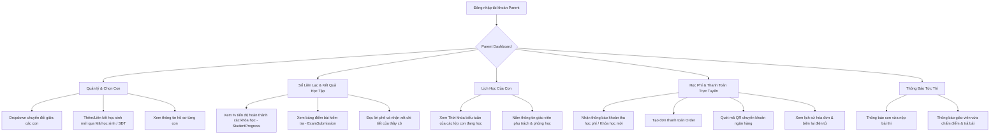

# Luồng Nghiệp Vụ: PARENT (Phụ Huynh Học Sinh)

## 1. Tổng quan Role
`PARENT` là tài khoản dành riêng cho cha mẹ hoặc người giám hộ của học sinh. 
Mục tiêu chính:
- **Quản lý đa học sinh (Multi-children):** Một phụ huynh có thể liên kết và theo dõi nhiều con (`ParentStudent`).
- **Sổ liên lạc điện tử:** Theo dõi sát sao tiến độ học tập (`StudentProgress`), điểm số và lời phê chi tiết của giáo viên (`ExamSubmission`, `teacher_feedback`).
- **Theo dõi lịch học:** Nắm bắt thời khóa biểu các buổi học (`ClassSession`) của từng con.
- **Thanh toán học phí & Khóa học:** Nhận thông báo học phí và trực tiếp thanh toán đơn hàng (`Order`) thay cho con.

---

## 2. Sơ đồ Luồng chính (Flowchart)

---

## 3. Chi tiết các Chức năng (Dành cho Frontend)

Frontend cần thiết kế giao diện thân thiện, dễ nhìn (đặc biệt tối ưu hiển thị trên Mobile App / Mobile Web cho phụ huynh bận rộn).

### 3.1. 👨‍👩‍👧 Bộ Chọn Hồ Sơ Con (Child Selector & Quick Switcher)
- **Mục đích:** Giúp phụ huynh có từ 2 con trở lên dễ dàng chuyển đổi dữ liệu mà không cần đăng xuất.
- **Thành phần UI cần có:**
  - Header Dropdown / Tab bar hiển thị Avatar và Tên của từng con (`StudentProfile`).
  - Nút "Liên kết thêm con" (`ParentStudent`): Nhập Mã định danh học sinh hoặc Số điện thoại để gửi yêu cầu liên kết.

### 3.2. 📊 Parent Dashboard (Tổng Quan Theo Từng Con)
- **Mục đích:** Nắm bắt nhanh tình hình học tập và các việc cần chú ý.
- **Thành phần UI cần có:**
  - Tóm tắt học tập của con đang chọn: Điểm trung bình gần nhất, Số bài tập đã nộp, Số buổi học trong tuần.
  - Widget "Cảnh báo / Cần thanh toán": Hiển thị các khoản học phí hoặc khóa học cần đóng tiền (`Order` trạng thái `PENDING`).
  - Lịch học hôm nay của con.

### 3.3. 📖 Sổ Liên Lạc Điện Tử & Bảng Điểm (Academic Tracking)
- **Mục đích:** Cung cấp thông tin minh bạch, chi tiết về học lực của con.
- **Thành phần UI cần có:**
  - Tab "Tiến độ Khóa học": Danh sách các khóa học con đang học, % hoàn thành (`StudentProgress.completion_pct`), bài học con đang dừng lại.
  - Tab "Kết quả Kiểm tra":
    - Danh sách các bài thi (`ExamSubmission`): Tên bài thi, Ngày nộp, Điểm số (`score`).
    - Xem chi tiết bài làm: Đọc câu trả lời của con và **Lời phê của giáo viên** (`teacher_feedback` trên từng câu tự luận, `teacher_notes` tổng quan).

### 3.4. 📅 Thời Khóa Biểu Của Con (Child's Timetable)
- **Mục đích:** Phụ huynh theo dõi để đưa đón hoặc nhắc nhở con vào bàn học.
- **Thành phần UI cần có:**
  - Lịch học tuần: Hiển thị các khối giờ học (`ClassSession`), Môn học, Tên giáo viên giảng dạy, Địa điểm phòng học offline hoặc link học online.

### 3.5. 💳 Đóng Học Phí & Mua Khóa Học (Tuition Billing & Checkout)
- **Mục đích:** Thanh toán các khoản phí học tập trực tiếp, nhanh chóng.
- **Thành phần UI cần có:**
  - Danh sách phiếu thu / học phí cần đóng.
  - Cổng thanh toán: Quét mã QR VietQR (ngân hàng), thẻ ngân hàng (`BANK`).
  - Lịch sử đóng học phí: Tra cứu lại các giao dịch đã hoàn tất (`PAID`), tải biên lai thu tiền.

### 3.6. 🔔 Trung Tâm Thông Báo (Push Notifications)
- **Mục đích:** Nhận tin tức quan trọng từ nhà trường và giáo viên.
- **Thành phần UI cần có:**
  - Danh sách `Notification`:
    - "Con bạn [Tên học sinh] vừa hoàn thành bài kiểm tra Toán 15 phút."
    - "Giáo viên [Tên GV] đã chấm điểm bài kiểm tra của con bạn: Điểm 9.0 kèm nhận xét mới."
    - "Thông báo thu học phí tháng X cho lớp Y."
