# Luồng Nghiệp Vụ: PRINCIPAL & VICE_PRINCIPAL (Ban Giám Hiệu / Chủ Trung Tâm)

## 1. Tổng quan Role
`PRINCIPAL` (Hiệu trưởng) hoặc `VICE_PRINCIPAL` (Hiệu phó) là người có quyền cao nhất bên trong một Trường học hoặc Trung tâm (Tenant-level). 
Mục tiêu chính:
- **Kinh doanh & Vận hành SaaS:** Mua và duy trì gói cước doanh nghiệp (`SchoolSubscription`) từ Super Admin để vận hành toàn bộ trung tâm.
- **Tổ chức bộ máy:** Thiết lập cơ cấu Phòng ban/Tổ bộ môn (`Department`), tuyển dụng/quản lý Giáo viên (`TEACHER`), Nhân viên (`STAFF`).
- **Quản lý học sinh:** Quản lý kho học sinh (`StudentProfile`) và kết nối Phụ huynh (`ParentStudent`).
- **Thương mại hóa khóa học:** Xuất bản khóa học của trường lên Marketplace để bán ra ngoài thu học phí trực tuyến.

---

## 2. Sơ đồ Luồng chính (Flowchart)

```mermaid
graph TD
    A[Đăng nhập bằng tài khoản Principal] --> B{Tenant Dashboard}
    
    %% Mua gói SaaS & Quản lý License
    B --> G[Gói Cước SaaS & Giới Hạn Quotas]
    G --> G1[Xem mức sử dụng Quotas: Học sinh, Giáo viên, Dung lượng]
    G --> G2[Mua / Gia hạn SchoolSubscription từ Super Admin]
    G --> G3[Nâng cấp gói khi số lượng học sinh vượt hạn mức]

    %% Bán khóa học & Doanh thu
    B --> H[Doanh Thu & Bán Khóa Học Trường]
    H --> H1[Duyệt đưa Khóa học trường lên Marketplace bán online]
    H --> H2[Theo dõi Đơn hàng Order & Doanh thu học phí]
    H --> H3[Xem đối soát hoa hồng với nền tảng]
    
    %% Quản lý Cơ sở vật chất & Sơ đồ
    B --> C[Quản lý Tổ chức & Bộ máy]
    C --> C1[Thiết lập thông tin chung School]
    C --> C2[Tạo/Xóa Tổ Bộ môn - Department]
    C --> C3[Bổ nhiệm Trưởng bộ môn]
    
    %% Quản lý Nhân sự
    B --> D[Quản lý Nhân Sự - Staff/Teacher]
    D --> D1[Mời/Thêm mới Giáo viên & Staff]
    D --> D2[Phân quyền SchoolRole]
    D --> D3[Phân bổ Giáo viên về Bộ môn]
    
    %% Quản lý Học sinh
    B --> E[Quản lý Học sinh toàn trường]
    E --> E1[Import danh sách học sinh - Excel]
    E --> E2[Quản lý thông tin Học sinh & Phụ huynh]
    
    %% Quản lý Học vụ
    B --> F[Giám sát Học vụ Toàn Trường]
    F --> F1[Xem danh sách Lớp học toàn trường]
    F --> F2[Báo cáo Điểm số tổng quan]
    F --> F3[Kiểm soát Ngân hàng câu hỏi của trường]
```

---

## 3. Chi tiết các Chức năng (Dành cho Frontend)

FE cần thiết kế một Layout cấp độ Trung tâm (`SchoolAdminLayout`).

### 3.1. 💳 Mua & Quản Lý Gói Cước SaaS (School Subscription / B2B Billing)
- **Mục đích:** Trung tâm mua bản quyền phần mềm để phục vụ học sinh và giáo viên của trường mình.
- **Thành phần UI cần có:**
  - Bảng đồng hồ Quotas (Usage Bars):
    - Học sinh: Đã dùng `X / max_students_total`.
    - Giáo viên: Đã dùng `Y / max_teachers`.
    - Dung lượng lưu trữ: Đã dùng `Z / storage_limit_gb`.
  - Bảng giá gói doanh nghiệp (`SubscriptionPackage`): Chọn gói theo Tháng/Năm, quét QR thanh toán `Order`.
  - Cảnh báo tự động khi Quota đạt trên 80% hoặc gói sắp hết hạn (`end_date`).

### 3.2. 🛍️ Quản Lý Bán Khóa Học & Doanh Thu Học Phí
- **Mục đích:** Trung tâm mở bán các khóa học thu tiền trực tuyến qua cổng Schoolify.
- **Thành phần UI cần có:**
  - Danh sách khóa học có gắn cờ thương mại (`is_marketplace = true`).
  - Thiết lập giá bán khóa học (`price`).
  - Bảng kê đơn mua khóa học của học sinh (`Order`), số tiền thực nhận sau khi trừ phí hoa hồng nền tảng (`COMMISSION_FEE`).

### 3.3. 📊 Tenant Dashboard
- **Thành phần UI:**
  - Thống kê: Tổng học sinh, Tổng giáo viên, Số lớp đang học, Doanh thu học phí tháng.
  - Lượt nộp bài và phổ điểm trung bình toàn trường.

### 3.4. 🏢 Quản lý Cấu trúc Tổ chức (Departments)
- **Thành phần UI:**
  - Tạo Tổ bộ môn mới (Tổ Toán, Tổ Tiếng Anh,...).
  - Gán Trưởng bộ môn (`head_teacher_id`).

### 3.5. 🧑‍🏫 Quản lý Nhân sự (Teachers & Staffs)
- **Thành phần UI:**
  - Danh sách giáo viên/nhân viên, phân quyền `SchoolRole`, gán vào Department.
  - Thêm mới nhân sự qua Email hoặc cấp tài khoản nhanh.

### 3.6. 🧑‍🎓 Quản lý Học sinh & Phụ huynh (Students & Parents)
- **Thành phần UI:**
  - Import/Export danh sách học sinh từ file Excel.
  - Profile học sinh kèm thông tin Phụ huynh liên kết (`ParentStudent`).

### 3.7. 📚 Giám sát Đào tạo (Classes & Question Banks)
- **Thành phần UI:**
  - Master View: Quản lý toàn bộ Lớp học, Khóa học và Ngân hàng câu hỏi của trường.
