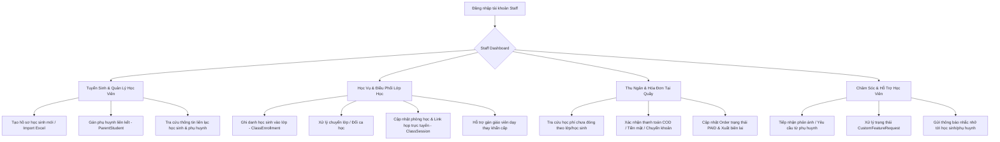

# Luồng Nghiệp Vụ: STAFF (Nhân Viên Giáo Vụ / Vận Hành Trung Tâm)

## 1. Tổng quan Role
`STAFF` là nhân sự vận hành hằng ngày tại các Trường học / Trung tâm (Tenant-level). 
Mục tiêu chính:
- **Tuyển sinh & Nhập liệu:** Tạo hồ sơ học sinh mới (`StudentProfile`), import danh sách từ Excel, liên kết học sinh với phụ huynh (`ParentStudent`).
- **Giáo vụ & Điều phối lớp học:** Xếp lớp (`ClassEnrollment`), xử lý chuyển lớp/bảo lưu, kiểm tra phòng học và link học trực tuyến (`ClassSession`).
- **Hỗ trợ thu ngân / Học phí:** Tra cứu đơn hàng (`Order`), xác nhận thu tiền mặt/chuyển khoản tại quầy, xuất hóa đơn/biên lai.
- **Chăm sóc học viên & Xử lý sự cố:** Tiếp nhận và xử lý các yêu cầu hỗ trợ (`CustomFeatureRequest`), gửi thông báo (`Notification`) chung từ nhà trường.

---

## 2. Sơ đồ Luồng chính (Flowchart)

---

## 3. Chi tiết các Chức năng (Dành cho Frontend)

Frontend cần thiết kế giao diện theo dạng **Portal Vận Hành Nhanh (Operations Portal)** với các thao tác tìm kiếm và xử lý đơn giản, tiện lợi.

### 3.1. 📊 Staff Dashboard
- **Mục đích:** Bảng theo dõi các đầu việc vận hành trong ngày.
- **Thành phần UI cần có:**
  - Lịch các ca học diễn ra trong ngày (`ClassSession`): Phòng nào đang học môn gì, giáo viên nào đang đứng lớp.
  - Widget "Học sinh mới đăng ký": Danh sách cần tư vấn hoặc xếp lớp.
  - Widget "Khoản thu chờ xử lý": Đơn hàng học phí đang chờ xác nhận thanh toán.

### 3.2. 🧑‍🎓 Tuyển Sinh & Quản Lý Học Viên (Admissions & Onboarding)
- **Mục đích:** Nhập liệu và quản lý thông tin học sinh nhanh chóng.
- **Thành phần UI cần có:**
  - Form thêm học sinh: Họ tên, Ngày sinh, Khối lớp (`grade_level`), SĐT, Email.
  - Chức năng **Import danh sách từ file Excel**: Kèm thanh tiến trình (Progress bar) và báo lỗi nếu dữ liệu trùng lặp.
  - Modal "Gán Phụ huynh": Nhập SĐT phụ huynh để tự động kết nối qua `ParentStudent`.

### 3.3. 🏫 Giáo Vụ & Điều Phối Lớp Học (Class Operations)
- **Mục đích:** Đảm bảo các buổi học diễn ra suôn sẻ, đúng lịch.
- **Thành phần UI cần có:**
  - Danh sách Lớp học (`Class`):
    - Thao tác "Ghi danh học viên" (`ClassEnrollment`).
    - Thao tác "Chuyển lớp": Rút học sinh từ Lớp A sang Lớp B chỉ bằng 1 cú click.
  - Quản lý Buổi học (`ClassSession`):
    - Đổi phòng học (`room`) nếu có sự cố cơ sở vật chất.
    - Cập nhật link Zoom/Google Meet (`meeting_url`) cho các buổi học trực tuyến.
    - Gán Giáo viên dạy thay (`teacher_id`) theo yêu cầu của Trưởng bộ môn/Hiệu trưởng.

### 3.4. 💵 Thu Ngân & Xác Nhận Học Phí (Cashier & Counter Billing)
- **Mục đích:** Hỗ trợ phụ huynh và học sinh đóng tiền trực tiếp tại cơ sở.
- **Thành phần UI cần có:**
  - Thanh tìm kiếm hóa đơn theo: Tên học sinh, Mã học sinh, hoặc SĐT.
  - Danh sách đơn thu tiền (`Order`):
    - Lọc các đơn đang `PENDING`.
    - Nút bấm: **"Xác nhận đã nhận tiền"** (Hệ thống chuyển trạng thái `OrderStatus` sang `PAID` và ghi nhận `Transaction`).
  - Nút **"In biên lai"**: Render giao diện hóa đơn để in máy in nhiệt hoặc tải file PDF gửi qua Zalo/Email cho phụ huynh.

### 3.5. 🎧 Chăm Sóc Khách Hàng & Thông Báo (Student Care & Messaging)
- **Mục đích:** Cầu nối giải quyết khúc mắc giữa Phụ huynh, Học sinh và Nhà trường.
- **Thành phần UI cần có:**
  - Bảng quản lý yêu cầu (`CustomFeatureRequest`):
    - Lọc theo trạng thái: `PENDING`, `IN_PROGRESS`, `RESOLVED`, `REJECTED`.
    - Khung nhập ghi chú tiến trình xử lý.
  - Công cụ gửi thông báo hàng loạt (`Notification`):
    - Gửi thông báo đến toàn bộ học sinh của một lớp hoặc toàn trường (VD: Lịch nghỉ lễ, Lịch thi học kỳ).
