# Luồng Nghiệp Vụ: STUDENT (Học Sinh / Học Viên)

## 1. Tổng quan Role
`STUDENT` là đối tượng trung tâm trải nghiệm các dịch vụ học tập, thi cử và tương tác trên nền tảng Schoolify.
Mục tiêu chính:
- Khám phá, đăng ký và tham gia các khóa học (`Course`), lớp học (`Class`).
- Học tập đa phương tiện (Xem video bài giảng, đọc tài liệu, theo dõi tiến độ `StudentProgress`).
- Tham gia các buổi học theo thời khóa biểu (`ClassSession`).
- Làm bài thi/kiểm tra trực tuyến (`ExamSubmission`, `SubmissionAnswer`) và xem kết quả, lời phê của giáo viên.
- Tích lũy điểm thưởng (`points`) và đổi quà tại cửa hàng (`StoreItem`, `StudentInventory`).

---

## 2. Sơ đồ Luồng chính (Flowchart)

```mermaid
graph TD
    A[Đăng nhập tài khoản Student] --> B{Student Dashboard}
    
    %% Khám phá & Đăng ký Khóa học
    B --> C[Khám Phá & Mua Khóa Học]
    C --> C1[Tìm kiếm khóa học theo danh mục Category]
    C --> C2[Xem chi tiết Course & Học thử]
    C --> C3[Thanh toán Mua khóa học - Tạo Order]
    
    %% Không gian Học tập
    B --> D[Không gian Học Tập Trực Tuyến]
    D --> D1[Xem danh sách Khóa học đang học]
    D --> D2[Trình phát Bài học: Video / Nội dung / Tài liệu]
    D --> D3[Hệ thống tự lưu tiến độ - StudentProgress]
    
    %% Lớp học & Thời khóa biểu
    B --> E[Lớp Học & Lịch Học]
    E --> E1[Xem danh sách Lớp học - ClassEnrollment]
    E --> E2[Xem Thời khóa biểu tuần - ClassSession]
    E --> E3[Nhấp link vào phòng học trực tuyến]
    
    %% Thi & Kiểm tra
    B --> F[Làm Bài Kiểm Tra & Xem Điểm]
    F --> F1[Mở bài kiểm tra theo bài học hoặc đề thi trường]
    F --> F2[Làm bài Trắc nghiệm & Tự luận]
    F --> F3[Nộp bài - ExamSubmission]
    F --> F4[Xem điểm số & Lời phê của giáo viên]
    
    %% Gamification & Đổi quà
    B --> G[Điểm Thưởng & Cửa Hàng]
    G --> G1[Xem điểm tích lũy - Points]
    G --> G2[Đổi điểm lấy Voucher / Vật phẩm - StoreItem]
    G --> G3[Xem Túi đồ đã sở hữu - StudentInventory]
```

---

## 3. Chi tiết các Chức năng (Dành cho Frontend)

Frontend cần thiết kế giao diện trẻ trung, hiện đại, tối ưu trải nghiệm học tập tập trung (Focus Mode) và hỗ trợ hoàn hảo trên Mobile/Tablet.

### 3.1. 📊 Student Dashboard
- **Mục đích:** Bảng điều khiển cá nhân hóa giúp học sinh nắm bắt lịch trình và tiến độ.
- **Thành phần UI cần có:**
  - Banner chào mừng kèm điểm thưởng tích lũy (`points`) và cấp bậc/danh hiệu.
  - Widget "Buổi học sắp diễn ra": Buổi học tiếp theo trong ngày kèm nút "Vào học ngay" (mở `meeting_url` hoặc báo phòng học).
  - Thanh tiến độ khóa học: Hiển thị các khóa học đang học dở và % hoàn thành gần nhất (`StudentProgress.completion_pct`).
  - Danh sách bài kiểm tra sắp tới hoặc mới có điểm.

### 3.2. 🛒 Khám Phá & Mua Khóa Học (Course Marketplace & Checkout)
- **Mục đích:** Tìm kiếm và đăng ký khóa học mới.
- **Thành phần UI cần có:**
  - Bộ lọc khóa học theo danh mục (`Category`), bộ môn (`Department`), giáo viên (`TeacherProfile`), giá tiền.
  - Trang Course Landing Page:
    - Video giới thiệu / Thông tin giáo viên / Đề cương chi tiết (Danh sách `Lesson`).
    - Nút "Học ngay" (nếu miễn phí) hoặc "Mua khóa học" (nếu có phí).
  - Modal thanh toán (`Order`): Chọn phương thức chuyển khoản ngân hàng (`BANK`), hiển thị mã QR thanh toán nhanh.

### 3.3. 🎓 Trình Phát Bài Học Tập Trung (Course Learning Player)
- **Mục đích:** Màn hình học bài không gây xao nhãng.
- **Thành phần UI cần có:**
  - Sidebar bên phải/trái: Danh sách chương mục và bài học (`Lesson`), có icon check xanh khi đã hoàn thành.
  - Khung chính:
    - Trình phát Video (tự động đánh dấu hoàn thành khi xem hết).
    - Khung đọc nội dung bài viết.
    - Khu vực tải tài liệu đính kèm (`LessonMaterial`): Nút tải file Word, Excel, Slide.
  - Nút "Bài trước" / "Bài tiếp theo".

### 3.4. 📅 Lớp Học & Thời Khóa Biểu (Class Schedule)
- **Mục đích:** Theo dõi lịch học trực tiếp của các lớp được phân công.
- **Thành phần UI cần có:**
  - Lịch học theo tuần (Weekly Timetable):
    - Khối buổi học (`ClassSession`): Hiển thị khung giờ (`start_time` - `end_time`), Tên giáo viên giảng dạy (kèm avatar), Phòng học hoặc Nút bấm mở link Zoom/Google Meet (`meeting_url`).
  - Danh sách lớp học đang tham gia (`ClassEnrollment`).

### 3.5. 📝 Giao Diện Làm Bài Thi Trực Tuyến (Online Exam Interface)
- **Mục đích:** Môi trường làm bài thi tiện lợi, minh bạch.
- **Thành phần UI cần có:**
  - Màn hình chuẩn bị: Thông tin bài thi, thời gian làm bài, số lượng câu hỏi.
  - Màn hình làm bài (Exam Runner):
    - Đồng hồ đếm ngược thời gian.
    - Danh sách câu hỏi kèm thanh điều hướng nhanh câu 1, 2, 3...
    - Câu trắc nghiệm (`MULTIPLE_CHOICE`, `SINGLE_CHOICE`, `TRUE_FALSE`): Radio button / Checkbox chọn đáp án (`Answer`).
    - Câu tự luận (`ESSAY`): Khung soạn thảo văn bản (`text_answer`).
    - Nút "Nộp bài" (`ExamSubmission`).
  - Màn hình kết quả (Exam Results):
    - Điểm tổng (`score`).
    - Xem lại chi tiết từng câu: Đáp án đúng, giải thích (`explain`), lời nhận xét riêng của giáo viên (`teacher_feedback`).

### 3.6. 🎁 Cửa Hàng Đổi Quà & Túi Đồ (Rewards & Student Inventory)
- **Mục đích:** Gamification gia tăng động lực học tập.
- **Thành phần UI cần có:**
  - Trang Store: Lưới các vật phẩm (`StoreItem`) gồm Voucher giảm giá, Huy hiệu, Quà tặng với số điểm tương ứng.
  - Modal xác nhận đổi điểm -> Trừ điểm `StudentProfile.points`.
  - Trang "Túi đồ của tôi" (`StudentInventory`): Quản lý các vật phẩm và mã voucher đã đổi thành công.
