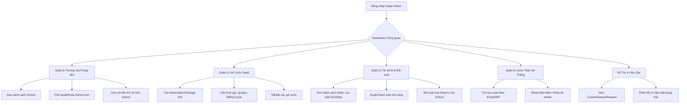

# Luồng Nghiệp Vụ: SUPER_ADMIN (Quản Trị Viên Hệ Thống)

## 1. Tổng quan Role
`SUPER_ADMIN` là tài khoản có quyền hạn cao nhất, đứng trên tất cả các Trường học/Trung tâm (Tenants). 
Mục tiêu chính của Role này là **quản trị nền tảng SaaS (B2B)**, bao gồm: Quản lý các đối tác (Trung tâm), Cấu hình các gói cước bán ra, Kiểm soát dòng tiền/doanh thu toàn hệ thống, và Hỗ trợ kỹ thuật cấp cao.

---

## 2. Sơ đồ Luồng chính (Flowchart)

---

## 3. Chi tiết các Chức năng (Dành cho Frontend)

FE cần thiết kế một Layout riêng biệt (VD: `AdminLayout`) với Sidebar chứa các Menu sau:

### 3.1. 📊 Dashboard
- **Mục đích:** Hiển thị các chỉ số sức khỏe của nền tảng.
- **Thành phần UI cần có:**
  - Tổng doanh thu nền tảng (Tháng/Năm).
  - Số lượng School (Tenants) đang Active / Suspended.
  - Số lượng Gói cước đang được mua nhiều nhất.
  - Biểu đồ đăng ký User mới.

### 3.2. 🏢 Quản lý Trường học / Trung tâm (Schools)
- **Mục đích:** Cấp phép hoặc đình chỉ hoạt động của các đối tác (B2B).
- **Thành phần UI cần có:**
  - Table danh sách `School` (Cột: Name, Code, Owner, Status, Created At).
  - Nút Action: **Activate** (Duyệt cho phép hoạt động), **Suspend** (Đình chỉ khi nợ phí hoặc vi phạm).
  - Màn hình Detail: Hiển thị chi tiết School đang dùng gói cước nào (`SchoolSubscription`).

### 3.3. 📦 Quản lý Gói cước (Subscription Packages)
- **Mục đích:** Bày bán các gói SaaS cho Chủ trung tâm hoặc Giáo viên tự do.
- **Thành phần UI cần có:**
  - Table danh sách `SubscriptionPackage`.
  - Form Tạo/Edit Gói cước (Form phức tạp):
    - Tên gói, Mô tả, Giá tiền (`price`).
    - Chu kỳ (`BillingCycle`): Dropdown (MONTHLY, YEARLY, LIFETIME).
    - Các Quotas: Ô input số (max_teachers, max_students_total, storage_limit_gb).
    - Toggle Bật/Tắt gói cước (`is_active`).

### 3.4. 💰 Quản lý Đơn hàng & Tài chính (Orders & Transactions)
- **Mục đích:** Nắm dòng tiền của toàn bộ hệ thống Schoolify.
- **Thành phần UI cần có:**
  - Table danh sách Đơn hàng (`Order`): Lọc theo Trạng thái (PENDING, PAID, CANCELLED).
  - Table danh sách Giao dịch (`Transaction`): Lọc theo Loại (Ví dụ: `PAYMENT_TO_ADMIN` - khách mua gói cước nền tảng, `COMMISSION_FEE` - phí hoa hồng cắt từ khóa học của trung tâm).
  - Nút Action: Cập nhật trạng thái `PAID` cho các đơn hàng thanh toán chuyển khoản thủ công.

### 3.5. 👥 Quản lý Users
- **Mục đích:** Tra cứu và xử lý sự cố cấp độ User.
- **Thành phần UI cần có:**
  - Thanh Search (Email/Phone).
  - Danh sách toàn bộ `User` (bất kể thuộc School nào).
  - Nút Action: Khóa tài khoản (`status = false`), Đổi mật khẩu khẩn cấp.

### 3.6. 🎫 Quản lý Yêu cầu (Custom Requests)
- **Mục đích:** Phản hồi các yêu cầu nâng cấp tính năng riêng từ các Trung tâm.
- **Thành phần UI cần có:**
  - Table `CustomFeatureRequest` (Lọc theo trạng thái: PENDING, IN_PROGRESS, RESOLVED).
  - Nút Action: Nhận xử lý hoặc Từ chối yêu cầu.
