# Luồng Nghiệp Vụ: TEACHER (Giáo Viên Giảng Dạy & Kinh Doanh Khóa Học)

## 1. Tổng quan Role
`TEACHER` trong Schoolify có thể hoạt động dưới 2 hình thức:
1. **Giáo viên trực thuộc Trường/Trung tâm:** Giảng dạy theo phân công của Ban giám hiệu và Trưởng bộ môn.
2. **Giáo viên tự do / Creator (Kinh doanh EdTech):** Mua gói cước SaaS từ Super Admin (`TeacherSubscription`) để mở quyền tạo lớp, tạo khóa học thương mại (`is_marketplace = true`) bán trực tiếp cho học sinh trên toàn nền tảng.

---

## 2. Sơ đồ Luồng chính (Flowchart)

```mermaid
graph TD
    A[Đăng nhập tài khoản Teacher] --> B{Teacher Dashboard}
    
    %% Mua gói SaaS & Mở khóa tính năng kinh doanh
    B --> H[Gói Cước & Quyền Kinh Doanh]
    H --> H1[Xem Bảng giá gói cước SaaS từ Admin]
    H --> H2[Mua/Nâng cấp gói TeacherSubscription]
    H --> H3[Mở khóa quyền: can_sell_courses, Dung lượng, Số lớp]

    %% Quản lý Khóa học & Bán khóa học
    B --> C[Quản lý Khóa Học & Bán Khóa Học]
    C --> C1[Tạo Khóa học mới - Course Builder]
    C --> C2[Cấu hình Bán: is_marketplace = true & Đặt giá price]
    C --> C3[Thêm Bài học, Video, Quiz, Tài liệu]
    C --> C4[Gửi duyệt hoặc Xuất bản trực tiếp lên Marketplace]
    
    %% Doanh thu & Dòng tiền
    B --> I[Doanh Thu & Rút Tiền]
    I --> I1[Xem báo cáo số lượng học sinh mua khóa học]
    I --> I2[Theo dõi thu nhập thực nhận - TEACHER_INCOME]
    I --> I3[Xem tỷ lệ hoa hồng chi trả cho Admin - COMMISSION_FEE]
    
    %% Quản lý Lớp học & Lịch dạy
    B --> D[Quản lý Lớp Học & Buổi Học]
    D --> D1[Xem danh sách Lớp học phụ trách]
    D --> D2[Xem danh sách Học sinh trong lớp]
    D --> D3[Tạo Buổi học - ClassSession: Phòng/Link meeting]
    D --> D4[Chỉ định Giáo viên dạy thay nếu bận]
    
    %% Ngân hàng Đề thi & Chấm bài
    B --> E[Đề Thi & Chấm Bài]
    E --> E1[Soạn Ngân hàng câu hỏi QuestionBank]
    E --> E2[Chấm bài Tự luận & Nhận xét chi tiết]
    E --> E3[Công bố điểm số cho học sinh]
    
    %% Gamification & Phần thưởng
    B --> G[Quản lý Phần Thưởng Học Sinh]
    G --> G1[Tạo Voucher/Huy hiệu/Quà tặng trong StoreItem]
    G --> G2[Cộng điểm thưởng thủ công cho học sinh]
```

---

## 3. Chi tiết các Chức năng (Dành cho Frontend)

### 3.1. 💳 Mua Gói Cước Kinh Doanh (Teacher Subscription / SaaS Pricing)
- **Mục đích:** Giáo viên tự do mua quyền sử dụng nền tảng và quyền mở bán khóa học từ Super Admin.
- **Thành phần UI cần có:**
  - Trang Bảng giá dịch vụ (Pricing Table):
    - Danh sách các gói `SubscriptionPackage` do Admin ban hành.
    - So sánh tính năng: Số lớp tối đa (`max_classes`), Học sinh/lớp (`max_students_per_class`), Dung lượng (`storage_limit_gb`), Quyền bán khóa học (`can_sell_courses = true/false`).
    - Nút chọn chu kỳ thanh toán: Tháng / Năm (`BillingCycle`).
  - Checkout & Thanh toán: Tạo đơn hàng `Order` (loại `SUBSCRIPTION`), quét mã QR / chuyển khoản ngân hàng.
  - Trang quản lý gói cước cá nhân: Xem ngày hết hạn (`end_date`), trạng thái (`ACTIVE`, `TRIALING`, `EXPIRED`), nút Gia hạn / Nâng cấp.

### 3.2. 🛍️ Tạo & Bán Khóa Học Lên Marketplace (Commercial Courses)
- **Mục đích:** Đóng gói kiến thức thành sản phẩm số để bán ra thị trường.
- **Thành phần UI cần có:**
  - Form tạo Course có mục cấu hình thương mại:
    - Toggle "Đăng lên Marketplace công khai" (`is_marketplace = true`).
    - Ô nhập giá bán khóa học (`price` VNĐ).
    - Cấu hình cho phép học thử một số bài học miễn phí (`Lesson` có preview).
  - Trình soạn thảo bài giảng (Rich text, Video, File đính kèm DOCX/Excel).
  - Trạng thái khóa học: `DRAFT` -> `PENDING` (chờ duyệt) -> `PUBLISHED` (đã mở bán).

### 3.3. 💰 Dashboard Doanh Thu & Thu Nhập (Teacher Revenue)
- **Mục đích:** Theo dõi hiệu quả kinh doanh của các khóa học.
- **Thành phần UI cần có:**
  - Card thống kê tài chính:
    - Tổng doanh thu bán khóa học.
    - Thu nhập thực nhận (`TEACHER_INCOME`).
    - Phí sàn / hoa hồng đã trích cho nền tảng (`COMMISSION_FEE`).
  - Bảng lịch sử đơn hàng (`Order`): Danh sách học sinh đã mua khóa học, thời gian mua, trạng thái thanh toán.
  - Yêu cầu đối soát / Rút tiền về tài khoản ngân hàng cá nhân.

### 3.4. 📊 Teacher Dashboard Giảng Dạy
- **Thành phần UI:**
  - Lịch dạy trong ngày/tuần (Upcoming `ClassSession`).
  - Widget "Bài tập chờ chấm" (`ExamSubmission` trạng thái `SUBMITTED`).
  - Danh sách lớp học và học sinh đang hoạt động.

### 3.5. 🏫 Quản lý Lớp Học & Thời Khóa Biểu (Classes & Sessions)
- **Thành phần UI:**
  - Danh sách Lớp (`Class`) & Sĩ số (`ClassEnrollment`).
  - Lịch học tuần: Thêm buổi học (`ClassSession`), phòng học offline (`room`) hoặc link họp trực tuyến (`meeting_url`), gán giáo viên dạy thay.

### 3.6. ✍️ Giao Diện Chấm Bài & Lời Phê (Grading & Evaluation Tool)
- **Thành phần UI:**
  - Chấm tự luận: Hiển thị câu trả lời dạng chữ (`text_answer`), ô cho điểm (`points_earned`), khung lời phê chi tiết (`teacher_feedback`).
  - Tự động cộng tổng điểm (`score`), nhập nhận xét chung (`teacher_notes`).

### 3.7. 🎁 Cửa Hàng Phần Thưởng (Store Items)
- **Thành phần UI:**
  - Tạo quà tặng, voucher (`StoreItem`) để học sinh đổi bằng điểm chuyên cần (`points`).
