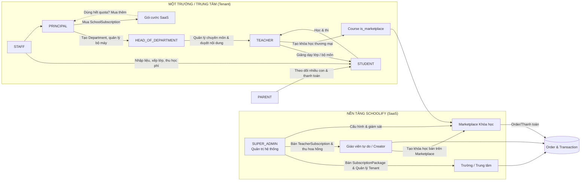
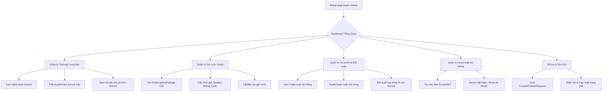
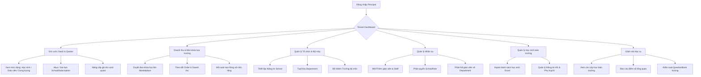
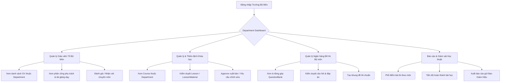
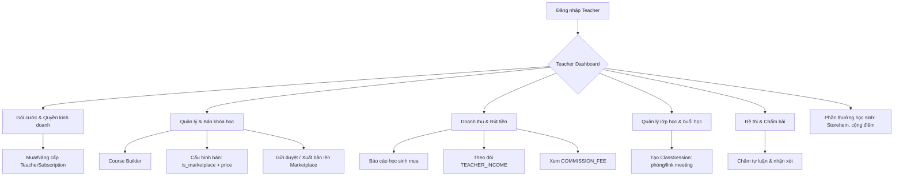
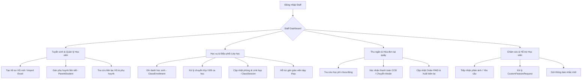
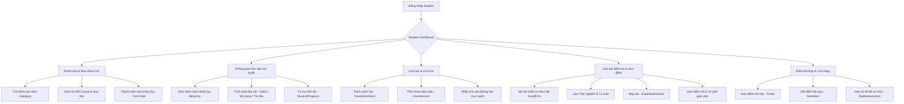
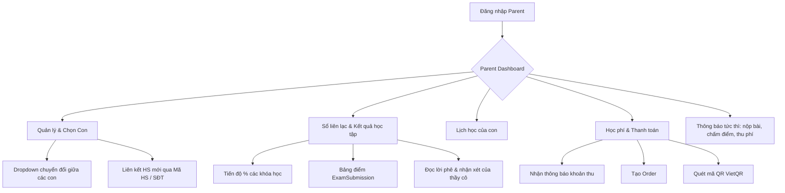

# 📘 Hướng Dẫn Tổng Quan Hệ Thống Schoolify (Master Guide)

> **Mục đích tài liệu:** File này là **bản tổng hợp duy nhất** giúp bất kỳ thành viên FE nào nắm được toàn bộ luồng hoạt động của dự án **Schoolify** — một nền tảng EdTech SaaS đa vai trò. Nội dung được tổng hợp từ toàn bộ tài liệu trong thư mục `docs/` (không thay thế, chỉ gom lại để đọc nhanh).

---

## 📑 Mục Lục

1. [Schoolify là gì? Kiến trúc tổng thể](#1--schoolify-là-gì-kiến-trúc-tổng-thể)
2. [Hệ thống vai trò (Roles) & Phân quyền](#2--hệ-thống-vai-trò-roles--phân-quyền)
3. [Sơ đồ luồng dữ liệu tổng quát](#3--sơ-đồ-luồng-dữ-liệu-tổng-quát)
4. [Chi tiết từng vai trò](#4--chi-tiết-từng-vai-trò)
   1. [SUPER_ADMIN](#41--super_admin--quản-trị-viên-nền-tảng)
   2. [PRINCIPAL / VICE_PRINCIPAL](#42--principal--vice_principal--ban-giám-hiệu--chủ-trung-tâm)
   3. [HEAD_OF_DEPARTMENT](#43--head_of_department--trưởng-bộ-môn)
   4. [TEACHER](#44--teacher--giáo-viên-giảng-dạy--kinh-doanh)
   5. [STAFF](#45--staff--nhân-viên-giáo-vụ--vận-hành-trung-tâm)
   6. [STUDENT](#46--student--học-sinh)
   7. [PARENT](#47--parent--phụ-huynh)
5. [Bộ nhận diện thương hiệu (Brand Guidelines)](#5--bộ-nhận-diện-thương-hiệu)
6. [Định hướng AI tương lai](#6--định-hướng-ai-tương-lai)
7. [Ghi chú kỹ thuật Git & Môi trường](#7--ghi-chú-kỹ-thuật-git--môi-trường)
8. [Đối chiếu nhanh với cấu trúc Frontend hiện tại](#8--đối-chiếu-nhanh-với-cấu-trúc-frontend-hiện-tại)

---

## 1. 🏫 Schoolify Là Gì? Kiến Trúc Tổng Thể

### 1.1. Định nghĩa sản phẩm
**Schoolify** = **School** *(Trường học)* + **-ify** *(Biến thành / Số hóa)*.
> *"Số hóa trường học, Khai phóng tri thức."*

Schoolify là **nền tảng vận hành & kinh doanh giáo dục toàn diện (EdTech SaaS)**, kết hợp 2 nhóm sản phẩm chính:

| Mảng | Đối tượng | Mô tả |
| :--- | :--- | :--- |
| **Học vụ K-12** | Trường học, Trung tâm (Tenant) | Quản lý trường/trung tâm, lớp học, giáo viên, học sinh, điểm danh, đề thi, chấm bài, sổ liên lạc điện tử |
| **Creator Economy** | Giáo viên tự do, Trung tâm | Tạo & bán khóa học online (`is_marketplace`), thu học phí trực tuyến, đối soát doanh thu, hoa hồng |

### 1.2. Mô hình kiến trúc: Multi-Tenant SaaS (B2B + B2C)
- **Super Admin** quản lý **nhiều Trường/Trung tâm** (Tenants), bán các **Gói cước SaaS** (`SubscriptionPackage`).
- Mỗi **Trường/Trung tâm (Tenant)** là một đơn vị độc lập, tự quản lý: bộ máy (`Department`), nhân sự (`TEACHER`, `STAFF`), học sinh (`StudentProfile`), phụ huynh (`ParentStudent`), và nội dung khóa học của riêng mình.
- **Giáo viên tự do / Creator** có thể mua riêng `TeacherSubscription` để mở khóa quyền kinh doanh khóa học trên toàn nền tảng.
- Dòng tiền xuyên suốt:
  - Phụ huynh/Học sinh **thanh toán** → Tạo `Order` → ghi nhận `Transaction`.
  - Nền tảng thu **`COMMISSION_FEE`** (hoa hồng) từ doanh thu khóa học của Trường/Creator.
  - Giáo viên/Creator nhận **`TEACHER_INCOME`** (thu nhập thực nhận sau khi trừ hoa hồng).

### 1.3. Các thực thể (Entity) cốt lõi lặp lại xuyên suốt các luồng

| Thực thể | Vai trò |
| :--- | :--- |
| `School` / `SchoolSubscription` | Trường/Trung tâm (Tenant) + gói cước đang dùng |
| `SubscriptionPackage` | Gói SaaS do Admin bán (giá, quotas: `max_teachers`, `max_students_total`, `storage_limit_gb`, `can_sell_courses`) |
| `Department` | Tổ bộ môn trong trường (Tổ Toán, Tổ Anh,...) |
| `User` / `SchoolMember` | Tài khoản gốc (SystemRole) + vai trò trong từng trường (`SchoolRole`) |
| `TeacherProfile` / `StudentProfile` / `ParentProfile` | Hồ sơ người dùng theo vai trò, gắn `department_id` / `school_id` |
| `Course` / `Lesson` / `LessonMaterial` | Khóa học → Danh sách bài giảng (video, nội dung, tài liệu PDF/Word/Slide) |
| `QuestionBank` / `QuestionType` | Ngân hàng câu hỏi — gồm `MULTIPLE_CHOICE`, `SINGLE_CHOICE`, `TRUE_FALSE`, `ESSAY` |
| `Exam` / `ExamSubmission` / `SubmissionAnswer` | Đề thi → Bài nộp của học sinh → Từng câu trả lời (điểm `points_earned`, lời phê `teacher_feedback`) |
| `Class` / `ClassEnrollment` | Lớp học (khóa học + giáo viên phụ trách) → Bảng ghi danh học sinh |
| `ClassSession` | Buổi học theo lịch (`start_time`, `end_time`, `room` / `meeting_url`) |
| `StudentProgress` | Tiến độ học tập: `completion_pct`, %, khóa học đang học dở |
| `Order` / `Transaction` | Đơn hàng (học phí, mua khóa học, mua gói SaaS) + Giao dịch thanh toán |
| `StoreItem` / `StudentInventory` | Vật phẩm đổi thưởng/điểm (`points`) + Túi đồ của học sinh |
| `Notification` | Trung tâm thông báo (nộp bài, chấm điểm, thu học phí, thông báo nhà trường) |
| `CustomFeatureRequest` | Yêu cầu hỗ trợ/tùy biến từ Trung tâm gửi lên Admin |
| `ParentStudent` | Bảng liên kết Phụ huynh ↔ Học sinh (1 phụ huynh – nhiều con) |

---

## 2. 👥 Hệ Thống Vai Trò (Roles) & Phân Quyền

| # | Vai trò | Nhóm | Quyền hạn / Triết lý thiết kế |
| :-: | :--- | :--- | :--- |
| 1 | **`SUPER_ADMIN`** | Quản trị nền tảng | Quyền cao nhất **toàn hệ thống** (không thuộc Trường nào). Quản trị SaaS, Tenant, Gói cước, Dòng tiền toàn nền tảng |
| 2 | **`PRINCIPAL` / `VICE_PRINCIPAL`** | Ban giám hiệu (Tenant-level) | Quyền cao nhất **trong một Trường/Trung tâm**. Vận hành, kế hoạch kinh doanh, duyệt nội dung, bổ nhiệm bộ máy |
| 3 | **`HEAD_OF_DEPARTMENT`** | Trưởng bộ môn | Kiêm nhiệm từ giáo viên: Quản lý chuyên môn, **thẩm định/duyệt** `Course` & `QuestionBank` của tổ |
| 4 | **`TEACHER`** | Giáo viên | Giảng dạy, quản lý lớp, soạn đề thi, chấm bài; đồng thời có thể là **Creator bán khóa học** |
| 5 | **`STAFF`** | Nhân sự vận hành trung tâm | Tuyển sinh/nhập liệu Excel, xếp lớp/giao vụ, **thu ngân học phí tại quầy**, chăm sóc học viên |
| 6 | **`STUDENT`** | Học sinh | Khám phá/mua khóa học, học bài, làm bài thi, đổi quà bằng điểm |
| 7 | **`PARENT`** | Phụ huynh | Theo dõi **đa con**, sổ liên lạc điện tử, lịch học, **thanh toán học phí** thay con |

> **Lưu ý thiết kế FE:** Người dùng có thể **mang nhiều vai trò cùng lúc** (vd: vừa `TEACHER` vừa `HEAD_OF_DEPARTMENT`). Cần màn hình **Switch Role** để chuyển đổi giao diện.

---

## 3. 🔄 Sơ Đồ Luồng Dữ Liệu Tổng Quát

---

## 4. 🔍 Chi Tiết Từng Vai Trò

> Với mỗi vai trò: **[Mục tiêu]** → **[Sơ đồ luồng chính]** → **[Các chức năng FE cần xây dựng]**.
> Tài liệu gốc đầy đủ tại `docs/flows/<role>_flow.md`.

---

### 4.1. 👑 SUPER_ADMIN — Quản trị viên nền tảng

**📄 Tài liệu gốc:** `docs/flows/super_admin_flow.md`

**Mục tiêu:** Quản trị nền tảng SaaS (B2B): quản lý Trường/Trung tâm (Tenant), bán gói cước, kiểm soát dòng tiền toàn hệ thống, hỗ trợ kỹ thuật cấp cao.

**Sơ đồ luồng:**

**Các chức năng FE cần có:**

| Nhóm | Chi tiết FE cần có |
| :--- | :--- |
| 📊 **Dashboard** | Tổng doanh thu nền tảng (tháng/năm); Số `School` Active/Suspended; Gói cước bán chạy nhất; Biểu đồ User đăng ký mới |
| 🏢 **Quản lý Schools** | Table `School` (Name, Code, Owner, Status, Created At); Actions: **Activate** / **Suspend**; Detail: gói cước `SchoolSubscription` đang dùng |
| 📦 **Quản lý Gói cước** | Table `SubscriptionPackage`; Form phức tạp: Tên, Mô tả, `price`, `BillingCycle` (MONTHLY / YEARLY / LIFETIME), Quotas (`max_teachers`, `max_students_total`, `storage_limit_gb`), Toggle `is_active` |
| 💰 **Đơn hàng & Tài chính** | Table `Order` (lọc PENDING / PAID / CANCELLED); Table `Transaction` (lọc `PAYMENT_TO_ADMIN`, `COMMISSION_FEE`); Action: cập nhật đơn chuyển khoản thủ công → `PAID` |
| 👥 **Quản lý Users toàn hệ thống** | Search Email/SĐT; Danh sách mọi `User` (bất kể School); Action: khóa tài khoản (`status=false`), reset mật khẩu khẩn cấp |
| 🎫 **Yêu cầu tùy biến** | Table `CustomFeatureRequest` (PENDING / IN_PROGRESS / RESOLVED); Action: nhận xử lý hoặc từ chối |

**Ghi chú FE:** Cần Layout riêng (`AdminLayout`) với Sidebar các mục trên (`/admin/dashboard`, `/admin/schools`, `/admin/packages`, `/admin/orders`, `/admin/users`).

---

### 4.2. 🏫 PRINCIPAL / VICE_PRINCIPAL — Ban giám hiệu / Chủ trung tâm

**📄 Tài liệu gốc:** `docs/flows/principal_flow.md`

**Mục tiêu:** Quyền cao nhất **trong một Tenant**: mua & duy trì gói doanh nghiệp, tổ chức bộ máy, quản lý học sinh, thương mại hóa khóa học của trường lên Marketplace.

**Sơ đồ luồng:**

**Các chức năng FE cần có:**

| Nhóm | Chi tiết FE cần có |
| :--- | :--- |
| 💳 **Subscription SaaS** | Bảng đồng hồ Quotas (Usage Bars `x/max`); Bảng giá gói doanh nghiệp; Quét QR tạo `Order`; Cảnh báo khi Quota ≥80% hoặc gói sắp hết hạn (`end_date`) |
| 🛍️ **Bán khóa học & Doanh thu** | Danh sách Course `is_marketplace=true`; Thiết lập giá; Bảng kê `Order`, số thực nhận sau trừ `COMMISSION_FEE` |
| 📊 **Tenant Dashboard** | Tổng HS/GV/Lớp; Doanh thu học phí tháng; Lượt nộp bài; Phổ điểm toàn trường |
| 🏢 **Departments** | Tạo Tổ bộ môn; Gán `head_teacher_id` |
| 🧑🏫 **Nhân sự** | Danh sách + phân quyền `SchoolRole`, gán Department; Mời qua Email |
| 🧑🎓 **Học sinh & Phụ huynh** | Import/Export Excel; Profile học sinh + liên kết `ParentStudent` |
| 📚 **Giám sát đào tạo (Master View)** | Quản lý toàn bộ Lớp, Khóa học, Question Bank của trường |

**Ghi chú FE:** Dùng Layout cấp Trung tâm (`SchoolAdminLayout`).

---

### 4.3. 🧑🏫 HEAD_OF_DEPARTMENT — Trưởng bộ môn

**📄 Tài liệu gốc:** `docs/flows/head_of_department_flow.md`

**Mục tiêu:** Quản lý chất lượng chuyên môn của **một Tổ bộ môn**: giám sát giáo viên, **thẩm định/duyệt** khóa học & ngân hàng câu hỏi, báo cáo chất lượng lên Ban giám hiệu.

**Sơ đồ luồng:**

**Các chức năng FE cần có:**

| Nhóm | Chi tiết FE cần có |
| :--- | :--- |
| 📊 **Department Dashboard** | Card: số GV trong tổ, khóa học đang chạy, đề thi đã duyệt, tổng HS học môn này; Widget **"Cần duyệt"** (`status=PENDING`); Biểu đồ phổ điểm |
| 🧑🏫 **Quản lý giáo viên** | Danh sách `TeacherProfile` theo `department_id`; Thông tin: chuyên môn `expertise`, `experience_years`, `classes_managed`, số khóa học đã tạo; Xem nhanh lịch dạy |
| 📖 **Quản lý & duyệt Course** | Bộ lọc `DRAFT / PENDING / PUBLISHED / REJECTED`; Xem cây bài giảng `Lesson` + tài liệu; Toolbar duyệt: **Approve** (→ `PUBLISHED`) / **Request Changes** (kèm khung lý do từ chối) |
| ❓ **QuestionBank của bộ môn** | Danh sách `QuestionBank` theo `school_id` + bộ môn; Duyệt & phân loại theo `QuestionType` & độ khó; Xuất khung đề thi chuẩn |
| 📈 **Báo cáo học thuật** | Tổng hợp `ExamSubmission` các lớp thuộc môn; Tỷ lệ câu hỏi làm sai nhiều nhất; Xuất PDF/Excel |

**Ghi chú FE:** Tích hợp vào Navigation dạng Tab riêng **"Quản trị Bộ môn"** hoặc dùng **Switch Role** (nếu vừa là `TEACHER`).

---

### 4.4. 🧑🏫 TEACHER — Giáo viên (giảng dạy & kinh doanh)

**📄 Tài liệu gốc:** `docs/flows/teacher_flow.md`

**Mục tiêu:** Giáo viên hoạt động theo **2 hình thức**:
1. **Giáo viên trực thuộc Trường/Trung tâm** — giảng dạy theo phân công.
2. **Giáo viên tự do / Creator** — mua `TeacherSubscription` để mở quyền tạo & bán khóa học.

**Sơ đồ luồng:**

**Các chức năng FE cần có:**

| Nhóm | Chi tiết FE cần có |
| :--- | :--- |
| 💳 **Bảng giá & Checkout gói** | Pricing Table so sánh gói (`max_classes`, `max_students_per_class`, `storage_limit_gb`, `can_sell_courses`); Chọn `BillingCycle`; Tạo `Order` loại `SUBSCRIPTION` + QR; Quản lý gói cá nhân (`ACTIVE / TRIALING / EXPIRED`, ngày `end_date`, gia hạn/nâng cấp) |
| 🛍️ **Course Builder & Marketplace** | Form tạo Course: toggle `is_marketplace=true`, ô `price`, cấu hình bài học preview miễn phí; Trình soạn thảo (rich text, video, file); Trạng thái `DRAFT → PENDING → PUBLISHED` |
| 💰 **Doanh thu & rút tiền** | Card: Tổng doanh thu, `TEACHER_INCOME`, `COMMISSION_FEE`; Bảng lịch sử `Order` (ai mua, khi nào); Yêu cầu đối soát/rút tiền về ngân hàng |
| 📊 **Teacher Dashboard** | Lịch dạy (Upcoming `ClassSession`); Widget bài tập chờ chấm (`ExamSubmission` = `SUBMITTED`); Danh sách lớp |
| 🏫 **Lớp học & thời khóa biểu** | Danh sách `Class` + sĩ số (`ClassEnrollment`); Lịch tuần: thêm `ClassSession` (`room`/`meeting_url`); Gán giáo viên dạy thay |
| ✍️ **Chấm bài & lời phê** | Hiển thị `text_answer`; ô cho `points_earned`; khung `teacher_feedback`; tự cộng `score`; nhập `teacher_notes` |
| 🎁 **Cửa hàng phần thưởng** | Tạo `StoreItem` (voucher/huy hiệu); Cộng điểm thưởng thủ công cho học sinh |

---

### 4.5. 🧑💼 STAFF — Nhân viên giáo vụ / vận hành trung tâm

**📄 Tài liệu gốc:** `docs/flows/staff_flow.md`

**Mục tiêu:** Vận hành hằng ngày tại Trung tâm: tuyển sinh/nhập liệu, xếp lớp, **thu ngân học phí tại quầy**, chăm sóc học viên & thông báo.

**Sơ đồ luồng:**

**Các chức năng FE cần có:**

| Nhóm | Chi tiết FE cần có |
| :--- | :--- |
| 📊 **Staff Dashboard** | Lịch ca học trong ngày (`ClassSession`); Widget học sinh mới đăng ký cần tư vấn/xếp lớp; Widget khoản thu chờ xử lý |
| 🧑🎓 **Tuyển sinh & nhập liệu** | Form thêm HS (họ tên, ngày sinh, `grade_level`, SĐT, email); **Import Excel** kèm progress bar & báo lỗi trùng; Modal gán phụ huynh (`ParentStudent`) qua SĐT |
| 🏫 **Giáo vụ & điều phối lớp** | Danh sách `Class`: thao tác Ghi danh (`ClassEnrollment`), **Chuyển lớp** 1 click; Quản lý `ClassSession`: đổi `room`, cập nhật `meeting_url`, gán dạy thay `teacher_id` |
| 💵 **Thu ngân tại quầy** | Search hóa đơn (tên/mã HS/SĐT); Lọc `Order` = `PENDING`; Nút **"Xác nhận đã nhận tiền"** (→ `PAID` + ghi `Transaction`); Nút **"In biên lai"** (máy in nhiệt hoặc PDF gửi qua Zalo/Email) |
| 🎧 **Chăm sóc & thông báo** | Bảng `CustomFeatureRequest` (lọc trạng thái, ghi chú tiến trình); Công cụ gửi `Notification` hàng loạt (theo lớp hoặc toàn trường — VD lịch nghỉ lễ, lịch thi) |

**Ghi chú FE:** Thiết kế kiểu **Portal Vận hành nhanh** — mọi thao tác tìm kiếm & xử lý phải đơn giản, tốc độ cao.

---

### 4.6. 🧑🎓 STUDENT — Học sinh

**📄 Tài liệu gốc:** `docs/flows/student_flow.md`

**Mục tiêu:** Khám phá & mua khóa học, học tập đa phương tiện, tham gia lớp học theo lịch (`ClassSession`), làm bài thi trực tuyến (`ExamSubmission`), tích điểm & đổi quà.

**Sơ đồ luồng:**

**Các chức năng FE cần có:**

| Nhóm | Chi tiết FE cần có |
| :--- | :--- |
| 📊 **Dashboard** | Banner chào mừng + điểm tích lũy `points` + cấp bậc; Widget **buổi học sắp diễn ra** (nút "Vào học ngay" → `meeting_url`); Thanh tiến độ khóa học (`completion_pct`); Danh sách bài kiểm tra sắp tới/mới có điểm |
| 🛒 **Marketplace & Checkout** | Bộ lọc (Category, Department, GV, giá); Course Landing Page (video giới thiệu, đề cương `Lesson`); Nút "Học ngay"/"Mua khóa học"; Modal thanh toán `Order` loại `BANK` + mã QR VietQR |
| 🎓 **Course Learning Player** | Sidebar chương mục + icon check xanh; Khung chính: Video player, khung đọc nội dung, tải `LessonMaterial` (Word/Excel/Slide); Nút Bài trước/Bài tiếp theo |
| 📅 **Lớp học & thời khóa biểu** | Lịch tuần (Weekly Timetable): khối `ClassSession` (khung giờ, GV kèm avatar, phòng/`meeting_url`); Danh sách lớp đang tham gia |
| 📝 **Làm bài thi online** | Màn hình chuẩn bị (thời gian, số câu); **Exam Runner**: đồng hồ đếm ngược, thanh điều hướng nhanh câu hỏi, radio/checkbox cho trắc nghiệm, khung soạn thảo cho tự luận (`text_answer`), nút "Nộp bài"; **Kết quả**: điểm `score`, xem lại từng câu (`explain`, `teacher_feedback`) |
| 🎁 **Đổi quà & Túi đồ** | Trang Store: lưới `StoreItem` (voucher, huy hiệu) kèm giá điểm; Modal xác nhận (trừ `StudentProfile.points`); Trang "Túi đồ của tôi" (`StudentInventory`) |

**Ghi chú FE:** Giao diện **trẻ trung, Gamification** — bo tròn (`rounded-2xl/3xl`), màu xanh lá điểm hoàn thành, hiệu ứng chúc mừng; tối ưu Mobile/Tablet.

---

### 4.7. 👨👩👧 PARENT — Phụ huynh

**📄 Tài liệu gốc:** `docs/flows/parent_flow.md`

**Mục tiêu:** Quản lý **đa học sinh** (nhiều con), sổ liên lạc điện tử, theo dõi lịch học, **thanh toán học phí/khóa học** trực tuyến thay con, nhận thông báo tức thì.

**Sơ đồ luồng:**

**Các chức năng FE cần có:**

| Nhóm | Chi tiết FE cần có |
| :--- | :--- |
| 👨👩👧 **Child Selector** | Dropdown/Tab bar Avatar + Tên từng con; Nút "Liên kết thêm con": nhập mã định danh/SĐT gửi yêu cầu (`ParentStudent`) |
| 📊 **Parent Dashboard** | Tóm tắt con đang chọn (ĐTB gần nhất, số bài nộp, số buổi/tuần); Widget **Cảnh báo cần thanh toán** (`Order` = `PENDING`); Lịch học hôm nay |
| 📖 **Sổ liên lạc điện tử** | Tab Tiến độ khóa học (danh sách + `completion_pct` + dừng ở đâu); Tab Kết quả kiểm tra (danh sách `ExamSubmission`: tên bài, ngày nộp, điểm; xem chi tiết kèm `teacher_feedback`/`teacher_notes`) |
| 📅 **Thời khóa biểu con** | Lịch tuần: khối giờ, môn, tên GV, địa điểm/phòng hoặc link online |
| 💳 **Đóng học phí & mua khóa học** | Danh sách phiếu thu cần đóng; Cổng thanh toán mã QR VietQR; Lịch sử giao dịch `PAID`; Tải biên lai |
| 🔔 **Trung tâm thông báo** | Danh sách `Notification` mẫu: *"Con đã hoàn thành bài kiểm tra..."*, *"GV đã chấm: 9.0 kèm nhận xét..."*, *"Thu học phí tháng X lớp Y..."* |

**Ghi chú FE:** Tối ưu Mobile (phụ huynh bận rộn); giao diện dễ nhìn, thân thiện.

---

## 5. 🎨 Bộ Nhận Diện Thương Hiệu

**📄 Tài liệu gốc:** `docs/nhan_dien_thuong_hieu.md`

### 5.1. Slogan & Tone of Voice
- **Slogan chính:** *"Schoolify — Số hóa trường học, Khai phóng tri thức."*
- **Tagline kinh doanh:** *"Nền tảng vận hành & kinh doanh giáo dục toàn diện."*
- **Tính cách:** Chuyên nghiệp & Tin cậy (K-12) • Trao quyền & Hiện đại (Creator) • Gần gũi & Dễ dùng (HS Lớp 1–12).

### 5.2. Bảng màu chuẩn (áp dụng khi code FE)

| Vai trò | Tên | Mã HEX | Ghi chú ứng dụng |
| :--- | :--- | :--- | :--- |
| ⭐ Primary Base | Schoolify Cyan | `#00B8DD` | Logo, Header, Button chính, Icon thương hiệu |
| Primary Dark | Deep Cyan | `#009BBD` | Hover Button, Active Menu, Scrolled Header |
| Primary Deep | Midnight Cyan | `#007D99` | Border, Focus Ring, Shadow |
| Primary Tint | Ice Cyan Tint | `#E6F8FC` | Background card, Badge, Pill chọn lọc |
| ⚡ Accent CTA | Energized Amber | `#F59E0B` | Nút mua khóa học, CTA dùng thử, Rating sao |
| ✅ Success | Growth Emerald | `#10B981` | Thanh tiến độ, điểm tối đa, badge hoàn thành |
| 🌑 Dark Neutral | Deep Ocean Navy | `#0A1E38` | Dark mode, Footer, Card tối |
| ☁️ Light Neutral | Cloud Ice White | `#F8FAFC` | Background Dashboard, Card bài học |
| ⚠️ Alert | Vibrant Coral | `#F43F5E` | Cảnh báo học phí quá hạn, bài cần nộp gấp |

### 5.3. Typography
- **Headings:** `Plus Jakarta Sans` hoặc `Lexend`
- **Body/UI Dashboard:** `Inter` (tối ưu màn hình, bảng số tài chính)

### 5.4. Nguyên tắc UI/UX bắt buộc
- **Header:** Nền Cyan `#00B8DD`, Logo trắng, CTA tương phản cao.
- **Student UI:** Gamification — bo tròn `rounded-2xl/3xl`, tiến trình màu emerald, huy hiệu, hiệu ứng chúc mừng.
- **Teacher/Admin UI:** Chuẩn SaaS chuyên nghiệp — tách bạch tab **Học vụ K-12** (điểm danh, đề thi, chấm bài) và tab **Kinh doanh Creator** (doanh thu, hoa hồng, rút tiền).
- **Certificate:** Nền trắng, viền Cyan, dấu mộc số hóa Schoolify.
- **Responsive bắt buộc** (mobile → tablet → desktop), mobile-first.

---

## 6. 🤖 Định Hướng AI Tương Lai

**📄 Tài liệu gốc:** `docs/AI-feature-idea.md`

Các **điểm chạm AI** được chia theo vai trò (chưa triển khai — là roadmap):

| Đối tượng | Tính năng AI |
| :--- | :--- |
| 🧑🏫 Teacher & HOD | 1) AI chấm tự luận + tạo lời phê (`ExamSubmission`/`SubmissionAnswer`), 2) Tạo ngân hàng câu hỏi/đề từ tài liệu, 3) Soạn đề cương/bài giảng (Copilot), 4) Phụ đề + tóm tắt video bài giảng |
| 🧑🎓 Student | 1) AI gia sư Socratic 24/7 trong bài học, 2) Chẩn đoán lỗ hổng kiến thức, 3) Tạo Flashcard/Mindmap ôn tập |
| 👨👩👧 Parent | 1) Báo cáo tổng kết học tập thông minh hàng tuần, 2) AI tư vấn đồng hành |
| 🏢 Principal & Staff | 1) Chatbot tư vấn tuyển sinh 24/7, 2) Dự báo nguy cơ bỏ học/học lực giảm |
| 👑 Super Admin | 1) Kiểm duyệt nội dung tự động trước khi xuất bản Marketplace |

**Technical stack đề xuất (khi triển khai):** LLM (Gemini/GPT/Claude) • RAG + `pgvector` • BullMQ + Redis cho tác vụ nền.
**Roadmap 3 phase:** Phase 1 = Sinh câu hỏi & chấm tự luận → Phase 2 = Gia sư AI & báo cáo phụ huynh → Phase 3 = Tuyển sinh tự động & chẩn đoán kiến thức.

---

## 7. ⚙️ Ghi Chú Kỹ Thuật Git & Môi Trường

**📄 Tài liệu gốc:** `docs/antigravity.md`

> ⚠️ **RẤT QUAN TRỌNG trên máy Unbuntu/Antigravity:** Git local **KHÔNG hỗ trợ HTTPS** (lỗi `git-remote-https`).

| Mục | Quy tắc |
| :--- | :--- |
| Giao thức | **BẮT BUỘC dùng SSH** — remote URL dạng `git@github.com:Kimthinh175/schoolify_FE.git` |
| Push target | **CHỈ** push tới `https://github.com/Kimthinh175/schoolify_FE` (branch `thinh`) |
| Bước setup 1 lần | Copy public key (`~/.ssh/id_ed25519.pub`) → Add tại `https://github.com/settings/ssh/new` |
| Kiểm tra | `ssh -T git@github.com` → chờ thông báo `Hi Kimthinh175! You've successfully authenticated...` |
| Lưu ý Agent | Không clone/push/pull bằng `https://`; nếu user chưa kết nối SSH → báo lỗi & hướng dẫn copy pubkey |

---

## 8. 🗺️ Đối Chiếu Nhanh Với Cấu Trúc Frontend Hiện Tại

> Quan sát nhanh cấu trúc `src/app` (dành cho người mới bắt đầu code): mỗi vai trò có một **Layout + nhóm route** riêng.

| Vai trò | Route segment | Màn hình chính hiện có |
| :--- | :--- | :--- |
| Super Admin | `src/app/admin/` | `dashboard`, `schools`, `packages`, `orders`, `users` |
| Principal | `src/app/school/` | `dashboard`, `departments`, `teachers`, `classes`, `admissions`, `cashier`, `subscription`, `curriculum-approval` |
| Teacher | `src/app/teacher/` | `dashboard`, `classes`, `courses`, `grading`, `revenue`, `rewards` |
| Student | `src/app/student/` | `dashboard`, `my-courses`, `learn`, `timetable`, `exams`, `exam`, `rewards`, `inventory` |
| Parent | `src/app/parent/` | `dashboard`, `academic`, `timetable`, `tuition` |
| Auth (chung) | `src/app/(auth)/` | `login` (+ 4 cổng riêng: `login/school`, `login/teacher`, `login/student`, `login/parent`), `register` |
| Public (chung) | `src/app/(public)/` | Trang chủ, `courses` (Marketplace) + `courses/[id]` (Course Landing), `pricing` |

**Route động (dynamic segment) đáng chú ý:** `student/learn/[courseId]/[lessonId]` (Course Learning Player), `student/exam/[examId]` (Exam Runner), `teacher/grading/[submissionId]` (Chấm bài), `courses/[id]` (Chi tiết khóa học Marketplace).

**Cấu trúc hỗ trợ chung:**
- `src/components/features/*` (hiện có `features/admin/QuotaBar.tsx`), `src/components/layout/*` (`AppHeader`, `AppSidebar`, `Navbar`, `Footer`, `DashboardLayoutWrapper`), `src/components/ui/*` (shadcn: `avatar`, `badge`, `button`, `card`, `dialog`, `dropdown-menu`, `input`, `progress`, `skeleton`, `table`, `tabs`).
- `src/services/*`: `school.service.ts`, `course.service.ts`, `exam.service.ts`, `order.service.ts` + barrel `index.ts` + mock `services/mock/data.ts`.
- `src/store/`: `auth.store.ts`, `parent.store.ts` (dùng `currentRole` / `currentSchoolId` để hỗ trợ **Switch Role**).
- `src/types/`: `auth.ts` (`SystemRole`, `SchoolRole`), `course`, `exam`, `order`, `school`, `store`, `index`.
- `src/lib/utils.ts` (`cn()`), `src/hooks/` và `src/constants/` (hiện mới là placeholder `.gitkeep`, chưa có mã nguồn).

---

## 📌 Phụ lục: Bản đồ tài liệu gốc trong `docs/`

| File gốc | Nội dung | Tóm trong mục |
| :--- | :--- | :--- |
| `docs/flows/super_admin_flow.md` | Luồng Super Admin | [4.1](#41--super_admin--quản-trị-viên-nền-tảng) |
| `docs/flows/principal_flow.md` | Luồng Principal/Vice Principal | [4.2](#42--principal--vice_principal--ban-giám-hiệu--chủ-trung-tâm) |
| `docs/flows/head_of_department_flow.md` | Luồng Trưởng bộ môn | [4.3](#43--head_of_department--trưởng-bộ-môn) |
| `docs/flows/teacher_flow.md` | Luồng Giáo viên | [4.4](#44--teacher--giáo-viên-giảng-dạy--kinh-doanh) |
| `docs/flows/staff_flow.md` | Luồng Nhân viên giáo vụ | [4.5](#45--staff--nhân-viên-giáo-vụ--vận-hành-trung-tâm) |
| `docs/flows/student_flow.md` | Luồng Học sinh | [4.6](#46--student--học-sinh) |
| `docs/flows/parent_flow.md` | Luồng Phụ huynh | [4.7](#47--parent--phụ-huynh) |
| `docs/nhan_dien_thuong_hieu.md` | Brand guidelines | [5](#5--bộ-nhận-diện-thương-hiệu) |
| `docs/AI-feature-idea.md` | Ý tưởng AI | [6](#6--định-hướng-ai-tương-lai) |
| `docs/antigravity.md` | Git & môi trường | [7](#7--ghi-chú-kỹ-thuật-git--môi-trường) |

---

*Tài liệu tổng hợp (Master Guide) — luôn đồng bộ với `docs/` gốc. Khi có thay đổi ở bất kỳ file nguồn nào, cần cập nhật lại file này.*